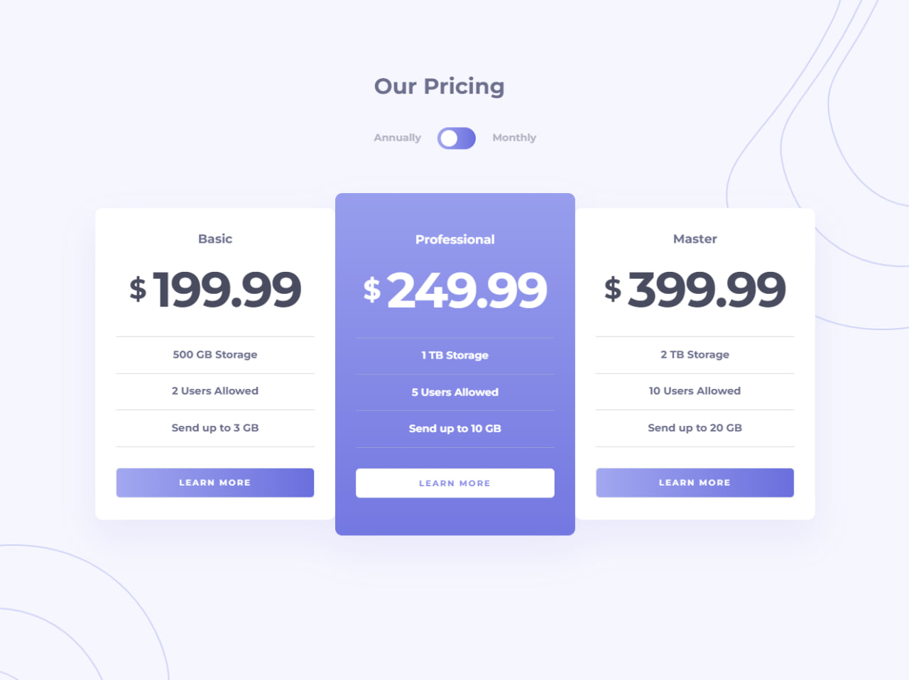
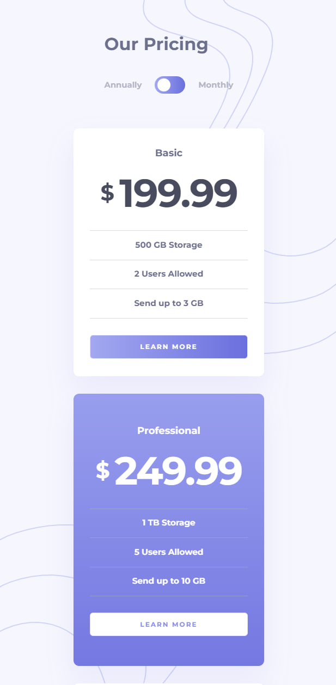

# Frontend Mentor - Pricing component with toggle

This is a solution to the [Pricing component with toggle challenge on Frontend Mentor](https://www.frontendmentor.io/challenges/pricing-component-with-toggle-8vPwRMIC). Frontend Mentor challenges help you improve your coding skills by building realistic projects. 

## Table of contents

- [Overview](#overview)
  - [The challenge](#the-challenge)
  - [Result](#result)
  - [Built with](#built-with)
- [Author](#author)

## Overview

### The challenge

Your users should be able to:

- View the optimal layout for the component depending on their device's screen size
- Control the toggle with both their mouse/trackpad and their keyboard
- **Bonus**: Complete the challenge with just HTML and CSS

### Result

### Built with

- Nextjs 13.5.4
- TypeScript
- [Framer-motion](https://www.framer.com/motion/) - JS library
- [Tailwind CSS](https://tailwindcss.com/)
- ESLint (Airbnb style guide)

## Author

- Frontend Mentor - [@somebodyin](https://www.frontendmentor.io/profile/somebodyin)